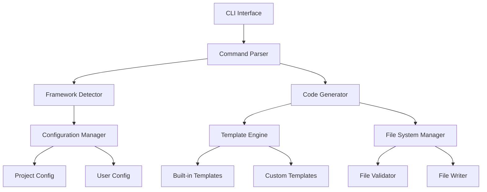

# Design Document

## Overview

El CLI generador de proyectos web para Rust será una herramienta de línea de comandos construida con Rust que automatiza la creación de componentes backend. La arquitectura seguirá un patrón modular con un sistema de plugins para soportar diferentes frameworks web, un motor de plantillas flexible y un sistema de configuración robusto.

## Architecture

### High-Level Architecture



### Core Components

1. **CLI Interface**: Punto de entrada principal usando `clap` para parsing de comandos
2. **Framework Detector**: Analiza el proyecto existente para detectar el framework web usado
3. **Template Engine**: Sistema basado en `handlebars` para generar código desde plantillas
4. **Configuration Manager**: Maneja configuración del proyecto y del usuario
5. **File System Manager**: Gestiona operaciones de archivos con validación y rollback
6. **Code Generator**: Orquesta la generación de código usando plantillas y configuración

## Components and Interfaces

### CLI Interface

```rust
// Estructura principal de comandos
#[derive(Parser)]
#[command(name = "rweb")]
#[command(about = "Rust Web CLI Generator")]
pub enum Commands {
    /// Initialize a new project
    Init {
        #[arg(short, long)]
        framework: Option<Framework>,
        #[arg(short, long)]
        name: String,
    },
    /// Generate a service
    Generate {
        #[command(subcommand)]
        component: GenerateComponent,
    },
    /// Configure templates and settings
    Config {
        #[command(subcommand)]
        action: ConfigAction,
    },
}

#[derive(Subcommand)]
pub enum GenerateComponent {
    Service { name: String, module: Option<String> },
    Route { name: String, methods: Vec<HttpMethod>, path: String },
    Guard { name: String, guard_type: GuardType },
    Module { name: String, components: Vec<ComponentType> },
}
```

### Framework Detection System

```rust
pub trait FrameworkDetector {
    fn detect(&self, project_path: &Path) -> Result<Framework, DetectionError>;
    fn supported_frameworks(&self) -> Vec<Framework>;
}

#[derive(Debug, Clone, PartialEq)]
pub enum Framework {
    Axum,
    ActixWeb,
    Warp,
    Rocket,
    Custom(String),
}

pub struct ProjectAnalyzer {
    detectors: Vec<Box<dyn FrameworkDetector>>,
}

impl ProjectAnalyzer {
    pub fn analyze_project(&self, path: &Path) -> ProjectInfo {
        // Analiza Cargo.toml, estructura de archivos, imports comunes
        // Retorna información del framework detectado y configuración
    }
}
```

### Template Engine

```rust
pub struct TemplateEngine {
    handlebars: Handlebars<'static>,
    template_registry: TemplateRegistry,
}

pub trait TemplateProvider {
    fn get_template(&self, component: ComponentType, framework: Framework) -> Result<Template, TemplateError>;
    fn list_templates(&self) -> Vec<TemplateInfo>;
    fn validate_template(&self, template: &Template) -> Result<(), ValidationError>;
}

pub struct Template {
    pub name: String,
    pub content: String,
    pub variables: Vec<TemplateVariable>,
    pub framework: Framework,
    pub component_type: ComponentType,
}

pub struct TemplateContext {
    pub component_name: String,
    pub module_name: Option<String>,
    pub framework: Framework,
    pub timestamp: String,
    pub author: Option<String>,
    pub custom_vars: HashMap<String, String>,
}
```

### Code Generator

```rust
pub struct CodeGenerator {
    template_engine: TemplateEngine,
    file_manager: FileSystemManager,
    config: ConfigurationManager,
}

impl CodeGenerator {
    pub async fn generate_service(&self, request: ServiceGenerationRequest) -> Result<GenerationResult, GenerationError> {
        // 1. Validar que el servicio no existe
        // 2. Obtener template apropiado
        // 3. Generar contexto de variables
        // 4. Renderizar template
        // 5. Escribir archivo
        // 6. Actualizar mod.rs si es necesario
    }
    
    pub async fn generate_route(&self, request: RouteGenerationRequest) -> Result<GenerationResult, GenerationError> {
        // Similar proceso para rutas
    }
    
    pub async fn generate_guard(&self, request: GuardGenerationRequest) -> Result<GenerationResult, GenerationError> {
        // Similar proceso para guards
    }
    
    pub async fn generate_module(&self, request: ModuleGenerationRequest) -> Result<GenerationResult, GenerationError> {
        // Genera estructura completa de módulo
    }
}
```

### File System Manager

```rust
pub struct FileSystemManager {
    project_root: PathBuf,
    dry_run: bool,
}

impl FileSystemManager {
    pub fn create_file(&self, path: &Path, content: &str) -> Result<(), FileSystemError> {
        // Validaciones de seguridad y existencia
        // Creación de directorios padre si es necesario
        // Escritura atómica del archivo
    }
    
    pub fn update_module_file(&self, module_path: &Path, new_export: &str) -> Result<(), FileSystemError> {
        // Actualiza archivos mod.rs para incluir nuevos componentes
    }
    
    pub fn validate_project_structure(&self) -> Result<(), ValidationError> {
        // Valida que la estructura del proyecto es compatible
    }
}
```

## Data Models

### Configuration Models

```rust
#[derive(Serialize, Deserialize, Debug)]
pub struct ProjectConfig {
    pub framework: Framework,
    pub project_name: String,
    pub author: Option<String>,
    pub template_directory: Option<PathBuf>,
    pub custom_variables: HashMap<String, String>,
    pub module_structure: ModuleStructure,
}

#[derive(Serialize, Deserialize, Debug)]
pub struct UserConfig {
    pub default_author: Option<String>,
    pub preferred_framework: Option<Framework>,
    pub custom_template_paths: Vec<PathBuf>,
    pub editor_integration: EditorConfig,
}

#[derive(Serialize, Deserialize, Debug)]
pub struct ModuleStructure {
    pub services_dir: String,
    pub routes_dir: String,
    pub guards_dir: String,
    pub models_dir: String,
}
```

### Generation Request Models

```rust
pub struct ServiceGenerationRequest {
    pub name: String,
    pub module: Option<String>,
    pub methods: Vec<String>,
    pub dependencies: Vec<String>,
}

pub struct RouteGenerationRequest {
    pub name: String,
    pub path: String,
    pub methods: Vec<HttpMethod>,
    pub middleware: Vec<String>,
    pub service_dependency: Option<String>,
}

pub struct GuardGenerationRequest {
    pub name: String,
    pub guard_type: GuardType,
    pub validation_rules: Vec<ValidationRule>,
}

pub struct ModuleGenerationRequest {
    pub name: String,
    pub components: Vec<ComponentRequest>,
    pub dependencies: Vec<String>,
}
```

## Error Handling

### Error Types Hierarchy

```rust
#[derive(Debug, thiserror::Error)]
pub enum CliError {
    #[error("Configuration error: {0}")]
    Configuration(#[from] ConfigError),
    
    #[error("Template error: {0}")]
    Template(#[from] TemplateError),
    
    #[error("File system error: {0}")]
    FileSystem(#[from] FileSystemError),
    
    #[error("Generation error: {0}")]
    Generation(#[from] GenerationError),
    
    #[error("Framework detection error: {0}")]
    Detection(#[from] DetectionError),
}

#[derive(Debug, thiserror::Error)]
pub enum GenerationError {
    #[error("Component '{0}' already exists")]
    ComponentExists(String),
    
    #[error("Invalid component name: {0}")]
    InvalidName(String),
    
    #[error("Template not found for framework {framework} and component {component}")]
    TemplateNotFound { framework: String, component: String },
    
    #[error("Failed to render template: {0}")]
    TemplateRender(String),
}
```

### Error Recovery Strategy

1. **Rollback Mechanism**: Todas las operaciones de archivo son transaccionales
2. **Validation First**: Validar antes de realizar cambios
3. **Detailed Logging**: Logs detallados para debugging
4. **User-Friendly Messages**: Mensajes de error claros con sugerencias de solución

## Testing Strategy

### Unit Testing

```rust
#[cfg(test)]
mod tests {
    use super::*;
    use tempfile::TempDir;
    
    #[tokio::test]
    async fn test_service_generation() {
        let temp_dir = TempDir::new().unwrap();
        let generator = setup_test_generator(temp_dir.path());
        
        let request = ServiceGenerationRequest {
            name: "UserService".to_string(),
            module: Some("users".to_string()),
            methods: vec!["create".to_string(), "find".to_string()],
            dependencies: vec![],
        };
        
        let result = generator.generate_service(request).await;
        assert!(result.is_ok());
        
        // Verificar que el archivo fue creado correctamente
        let service_path = temp_dir.path().join("src/users/services/user_service.rs");
        assert!(service_path.exists());
    }
}
```

### Integration Testing

1. **Framework Detection Tests**: Probar detección con proyectos reales de cada framework
2. **Template Rendering Tests**: Verificar que las plantillas generan código válido
3. **File System Tests**: Probar operaciones de archivo en diferentes sistemas operativos
4. **End-to-End Tests**: Generar proyectos completos y verificar que compilan

### Performance Testing

1. **Template Rendering Performance**: Medir tiempo de renderizado de plantillas grandes
2. **File System Performance**: Probar con estructuras de proyecto grandes
3. **Memory Usage**: Verificar uso de memoria durante generación de múltiples componentes

## Framework-Specific Implementations

### Axum Support

```rust
pub struct AxumTemplateProvider;

impl TemplateProvider for AxumTemplateProvider {
    fn get_template(&self, component: ComponentType, _framework: Framework) -> Result<Template, TemplateError> {
        match component {
            ComponentType::Service => Ok(Template {
                name: "axum_service".to_string(),
                content: include_str!("../templates/axum/service.hbs"),
                variables: vec![
                    TemplateVariable::new("service_name", "String"),
                    TemplateVariable::new("methods", "Vec<String>"),
                ],
                framework: Framework::Axum,
                component_type: ComponentType::Service,
            }),
            ComponentType::Route => Ok(Template {
                name: "axum_route".to_string(),
                content: include_str!("../templates/axum/route.hbs"),
                // ... más configuración
            }),
            // ... otros componentes
        }
    }
}
```

### Template Examples

#### Service Template (Axum)

```handlebars
use axum::{extract::State, http::StatusCode, Json};
use serde::{Deserialize, Serialize};
use std::sync::Arc;

#[derive(Debug, Serialize, Deserialize)]
pub struct {{pascal_case service_name}}Request {
    // TODO: Define request structure
}

#[derive(Debug, Serialize, Deserialize)]
pub struct {{pascal_case service_name}}Response {
    // TODO: Define response structure
}

pub struct {{pascal_case service_name}}Service {
    // TODO: Add service dependencies
}

impl {{pascal_case service_name}}Service {
    pub fn new() -> Self {
        Self {
            // TODO: Initialize dependencies
        }
    }

    {{#each methods}}
    pub async fn {{snake_case this}}(&self, request: {{pascal_case ../service_name}}Request) -> Result<{{pascal_case ../service_name}}Response, ServiceError> {
        // TODO: Implement {{this}} logic
        todo!("Implement {{this}} method")
    }
    {{/each}}
}

#[derive(Debug, thiserror::Error)]
pub enum ServiceError {
    #[error("Internal server error")]
    Internal,
    // TODO: Add specific error types
}
```

## Security Considerations

1. **Path Traversal Protection**: Validar que los paths de archivos están dentro del proyecto
2. **Template Injection**: Sanitizar variables de template para prevenir inyección de código
3. **File Permissions**: Crear archivos con permisos apropiados
4. **Input Validation**: Validar nombres de componentes y paths

## Performance Optimizations

1. **Template Caching**: Cache de plantillas compiladas en memoria
2. **Lazy Loading**: Cargar plantillas solo cuando se necesiten
3. **Parallel Generation**: Generar múltiples componentes en paralelo cuando sea posible
4. **Incremental Updates**: Solo actualizar archivos que realmente cambiaron